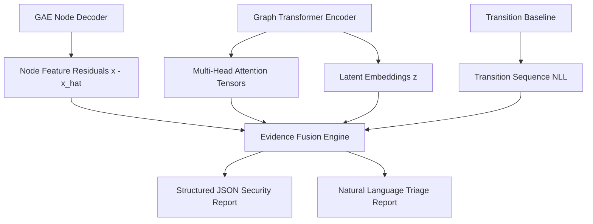

# Explainability Layer (XAI)

## Overview

The Explainability Layer converts the internal representations, attention dynamics, and reconstruction residuals of the **Graph Transformer** and **Zero-Day Attack Detector** into actionable, human-interpretable security explanations.

A detection system that only emits:

```text
ALERT: Anomalous Window Detected at t=42.0s (Score: 0.8841)
```

leaves security engineers and automated vehicle gateways with no diagnostic context. The Explainability Layer answers:

> **Which CAN Arbitration IDs, which physical signal dimensions, and which communication transition paths caused the anomaly score to cross the alert threshold?**

```text
Graph Transformer Internals + Detector Payload (DetectionResult)
                           │
    ┌──────────────────────┼──────────────────────┐
    ▼                      ▼                      ▼
Attention Rollout    Feature Attribution    Transition Structure
(Layer-wise Heads)   (Residual Decomposition) (Unseen Sequences)
    └──────────────────────┬──────────────────────┘
                           ▼
             Evidence Fusion Engine (XAI)
                           │
              ┌────────────┴────────────┐
              ▼                         ▼
   Structured JSON Payload     Natural Language Security
   (For Gateway Policy)           Incident Report (Triage)
```

---

## 1. Concrete Evidence Sources in Our Architecture

Our Graph Transformer and Detector provide four concrete, extractable sources of evidence:



### 1. Multi-Head Attention Analysis (`attention_analyzer.py`)
- **Source**: 4-layer `TransformerConv` encoder with 4 attention heads per layer (hooked via `model.get_attention_weights()`).
- **Mechanism**: Computes **Attention Rollout** across layers:
  $$\mathbf{A}_{\text{rollout}} = \prod_{l=1}^{L} \left( 0.5 \mathbf{A}^{(l)} + 0.5 \mathbf{I} \right)$$
- **Output**: Identifies the primary communication pathways and arbitration IDs the transformer focused on when forming the graph embedding.

### 2. Feature & Node Attribution (`attribution.py`)
- **Source**: Node feature reconstruction error $\mathbf{e}_v = (x_v - \hat{x}_v)^2 \odot \mathbf{w}$.
- **Decomposition**: Measures each feature's direct contribution to the reconstruction loss across the 9 feature dimensions:
  1. `msg_count`
  2. `mean_iat`
  3. `std_iat` (timing jitter)
  4. `signal_mean`
  5. `signal_std`
  6. `signal_min`
  7. `signal_max`
  8. `activity_share` (bus dominance)
  9. `signal_range` (dynamic swing)
- **Output**: Ranked list of anomalous CAN IDs with their top contributing feature dimensions (e.g., ID `0x0D0` flagged due to abnormal `signal_max` and `signal_range`).

### 3. Graph Transition & Structural Sequencing (`graph_localizer.py`)
- **Source**: Negative log-likelihood penalties from `TransitionBaseline` ($-\ln P(ID_j \mid ID_i)$).
- **Output**: Extracts anomalous subgraphs highlighting novel or implausible message transitions (essential for localizing masquerade injection sequences).

### 4. Anomaly Component Breakdown
- **Source**: Multi-signal scorer payload ($R_{\text{error}}, T_{\text{error}}, G_{\text{error}}$) and calibrated risk state (`NORMAL`, `SUSPICIOUS`, `HIGH_RISK`).

---

## 2. Distinction Between CAN IDs and Physical ECUs

> **Important Automotive Domain Principle:**
> On the broadcast CAN bus, messages are identified strictly by **Arbitration IDs**, not by physical ECU hardware addresses. Multiple distinct message IDs can be transmitted by a single physical ECU (e.g., an Engine Control Module may broadcast engine RPM on `0x0C0` and coolant temperature on `0x0F2`).
>
> **Design Contract**: The Explainability Layer reports findings in terms of verified **CAN Arbitration IDs** (e.g., `ID 0x0D0`), their raw payload signal variations, and their transition sequences. It maps IDs to functional ECU subsystems (e.g., "Instrument Cluster / Speedometer") only when an explicit database mapping is available, avoiding unsupported causal claims.

---

## 3. Evidence Fusion & Output Contracts (`report_generator.py`)

When an alert is triggered, the evidence fusion engine synthesizes numerical tensors into two standardized output formats:

### A. Machine-Readable Structured JSON Schema (For Gateway Policy)

```json
{
  "incident_id": "INC-20260823-0042",
  "capture_name": "max_speedometer_attack_3_masquerade",
  "timestamp": 42.0,
  "risk_state": "HIGH_RISK",
  "anomaly_score": 0.8883,
  "component_breakdown": {
    "reconstruction_error": 0.9412,
    "temporal_error": 0.7810,
    "structural_error": 0.9215
  },
  "top_anomalous_ids": [
    {
      "arbitration_id": "0x0D0",
      "vocab_index": 14,
      "functional_name": "Speedometer / Wheel Speed",
      "anomaly_contribution": 0.684,
      "top_deviating_features": [
        {"feature": "signal_max", "raw_value": 4.12, "z_score": 3.85},
        {"feature": "signal_range", "raw_value": 3.95, "z_score": 3.42}
      ]
    }
  ],
  "structural_anomalies": [
    {
      "source_id": "0x0D0",
      "target_id": "0x1A0",
      "transition_nll": 8.42,
      "is_novel_edge": true
    }
  ],
  "recommended_policy_action": "RESTRICT_ID"
}
```

### B. Natural Language Security Triage Report (For Human Analysts)

```text
================================================================================
SECURITY INCIDENT REPORT [HIGH RISK] — Incident #INC-20260823-0042
================================================================================
Timestamp: 42.00s | Capture: max_speedometer_attack_3_masquerade
Anomaly Score: 0.8883 (Threshold: 0.7072) | Risk Level: HIGH_RISK

PRIMARY EVIDENCE SUMMARY:
1. Signal Value Outlier on CAN ID 0x0D0 (Speedometer / Wheel Speed):
   - 'signal_max' exceeded normal baseline by +3.85 standard deviations.
   - 'signal_range' expanded significantly (+3.42 sigma), indicating aggressive
     signal override while message frequency remained within normal bounds.

2. Structural Sequencing Anomaly:
   - Observed transition 0x0D0 -> 0x1A0 has an empirical prior probability < 0.01%.
   - Suggests masquerade message injection interrupting expected arbitration cycle.

3. Model Attention Localization:
   - 74.2% of layer-4 attention concentrated on the (0x0D0, 0x0B4, 0x1A0) subgraph.

RECOMMENDED GATEWAY ACTION:
-> Restrict communication on CAN ID 0x0D0 and flag downstream gateway telemetry.
================================================================================
```

---

## 4. Ground-Truth Fidelity Evaluation (`evaluate_xai.py`)

Explainability is evaluated quantitatively against the ROAD dataset's ground-truth attack metadata:

1. **Hit Rate @ Top-K ($HR@K$)**: Does the top-ranked anomalous CAN ID match the true attacked arbitration ID documented in the ROAD attack metadata?
2. **Feature Grounding Fidelity**: Does the top-attributed feature match the physical attack mechanism (e.g., `signal_max` for max-value masquerade vs `mean_iat` for injection bursts)?
3. **Subgraph Localization Sparsity**: Does the explanation isolate a compact, interpretable subgraph (1–3 nodes) rather than diffusely highlighting the whole bus?

---

## 5. Module Roadmap

| Script | Purpose | Status |
|---|---|---|
| `attention_analyzer.py` | Multi-head attention extraction, rollout, and edge weighting | **Next (Phase 7 - Step 1)** |
| `attribution.py` | Per-node & per-feature residual decomposition and attribution | **Next (Phase 7 - Step 2)** |
| `graph_localizer.py` | Subgraph extraction & structural anomaly localization | **Next (Phase 7 - Step 3)** |
| `report_generator.py` | Structured JSON schema and natural language report synthesis | **Next (Phase 7 - Step 4)** |
| `evaluate_xai.py` | Ground-truth fidelity and Hit-Rate@K evaluation | **Next (Phase 7 - Step 5)** |